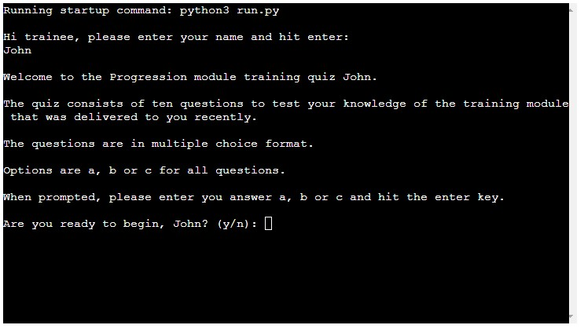

# Training Evaluation Quiz
The purpose of this quiz is for Teachers/Trainers to evaluate whether the learners have a good grasp of the theory module concepts and contents that have been delivered to them previously. A link would be sent to the students for them to complete the 10 question quiz, and the name and final score is exported to a Google worksheet where the teacher can view and determine if the score is sufficient, or more training is required.

The live website on Heroku can be accessed at the following link: [View my Live Website on Heroku here](https://progression-training-quiz.herokuapp.com/)

## CONTENTS

* [Introduction](#training-evaulation-quiz)

* [Features](#features)
    *  [Trainee Name Request](#trainee-name-request)
    *  [Introduction and Instructions](#introduction-and-instructions)
    *  [Questions](#questions)
    *  [Final Score and Thank you](#final-score-and-thank-you)
* [User Experience](#user-experience)
    *  [User Stories](#user-stories)
* [Design](#design)
    *  [Colour Palette](#colour-palette)
    *  [Typography](#typography)
    *  [Imagery](#imagery)
    *  [Wireframes](#wireframes)
    *  [Accessibility](#accessibility)
* [Technologies Used](#technologies-used)   
    *  [Languages Used](#languages-used)
    *  [Frameworks, Libraries and Programs Used](#frameworks-libraries-and-programs-used)
* [Testing](#testing)
    * [Validator Testing](#validator-testing)
    * [Responsiveness Testing](#responsiveness-testing)
    * [Accessibility Testing](#accessibility-testing)
    * [User Story Testing](#user-story-testing)
    * [Bugs](#Bugs)
* [Deployment](#deployment)
* [Credits](#credits)
* [Acknowledgements](#acknowledgements)

## Features

### Existing Sections
- #### **Trainee Name Request**
    - This initial input statement requests the trainee to enter their name to proceed.
    - If a name is not entered, a validation message appears informing them that a name is required to complete the quiz
    - Their name is then requested again
    - Once a name is entered, they move to the introduction and instruction section

- #### **Introduction and Instructions**
    - This section greets the trainee using the name they have entered previously to personalise the experience.
    - It outlines the following information to the user:
        - the amount of questions contained in the quiz,
        - the format of the questions,
        - the different options that can be chosen and
        - how to chose the option you want.
    - It then asks the user if they ready to proceed with the quiz, if so, the quiz begins.
    - If they select no, a warning message appears to tell them that the quiz is mandatory and must be completed by the deadline assigned.
    

- #### **Questions**
    - The questions appear one at a time, along with the 3 possible options
    - There is then a space for the user to enter their answer along with a further reminder that the options are only a, b or c.

- #### **Final Score and Thank you**
    - once the user reaches the end of the quiz, the trainee is congratulated and told their final score.
    - A message appears informing them that the results worksheet is being updated
    - They are thanked and wished a nice day

### Future Features

## User Experience

### User Stories

#### Client Goals
- 
- 
- 
#### User Goals
- 
- 
- 
- 
-

## Design

### Wireframes
- I designed the website firstly through hand drawn sketches that were then turned into basic wireframes on Figma, before being made into high fidelity wireframes.

### Accessibility

## Technologies used

### Languages used
- Python

### Frameworks, Libraries and Programs used
- [GitHub](https://github.com)
- [Gitpod](https://gitpod.io/workspaces)

- [Am I Responsive](http://ami.responsivedesign.is/)

- [Chrome Dev Tools](https://www.google.com/intl/en_ie/chrome/)

## Testing

### Validator Testing

### Responsiveness Testing

#### Chrome

### Accessibility Testing

#### Firefox

### User Story Testing
- I used the user stories to perform manual testing on the game to see whether there were any blockers to the user goals identified above. These are the results:

#### Client Goals
1. 
    
#### User Goals
1. 

## Deployment

## Bugs
### Fixed Bugs
- 
### Known Bugs
- 

## Credits

### Code

### Content

-

### Media

- 

## Acknowledgements
 - 