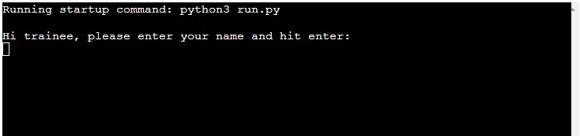

# Training Evaluation Quiz
The purpose of this quiz is for Teachers/Trainers to evaluate whether the learners have a good grasp of the theory module concepts and contents that have been delivered to them previously. A link would be sent to the students for them to complete the 10 question quiz, and the name and final score is exported to a Google worksheet where the teacher can view and determine if the score is sufficient, or more training is required.

The live website on Heroku can be accessed at the following link: [View my Live Website on Heroku here](https://progression-training-quiz.herokuapp.com/)

## CONTENTS

* [Introduction](#training-evaulation-quiz)

* [Features](#features)
    *  [Trainee Name Request](#trainee-name-request)
    *  [Introduction and Instructions](#introduction-and-instructions)
    *  [Questions](#questions)
    *  [Final Score and Thank you](#final-score-and-thank-you)
* [User Experience](#user-experience)
    *  [User Stories](#user-stories)
* [Design](#design)
    *  [Colour Palette](#colour-palette)
    *  [Typography](#typography)
    *  [Imagery](#imagery)
    *  [Wireframes](#wireframes)
    *  [Accessibility](#accessibility)
* [Technologies Used](#technologies-used)   
    *  [Languages Used](#languages-used)
    *  [Frameworks, Libraries and Programs Used](#frameworks-libraries-and-programs-used)
* [Testing](#testing)
    * [Validator Testing](#validator-testing)
    * [Responsiveness Testing](#responsiveness-testing)
    * [Accessibility Testing](#accessibility-testing)
    * [User Story Testing](#user-story-testing)
    * [Bugs](#Bugs)
* [Deployment](#deployment)
* [Credits](#credits)
* [Acknowledgements](#acknowledgements)

## Features

### Existing Sections
- #### **Trainee Name Request**
    - This initial input statement requests the trainee to enter their name to proceed.
    - If a name is not entered, a validation message appears informing them that a name is required to complete the quiz
    - Their name is then requested again
    - Once a name is entered, they move to the introduction and instruction section

- #### **Introduction and Instructions**
    - This section greets the trainee using the name they have entered previously to personalise the experience.
    - It outlines the following information to the user:
        - the amount of questions contained in the quiz,
        - the format of the questions,
        - the different options that can be chosen and
        - how to chose the option you want.
    - It then asks the user if they ready to proceed with the quiz, if so, the quiz begins.
    - If they select no, a warning message appears to tell them that the quiz is mandatory and must be completed by the deadline assigned.
    

- #### **Questions**
    - The questions appear one at a time, along with the 3 possible options
    - There is then a space for the user to enter their answer along with a further reminder that the options are only a, b or c.

- #### **Final Score and Thank you**
    - once the user reaches the end of the quiz, the trainee is congratulated and told their final score.
    - A message appears informing them that the results worksheet is being updated
    - They are thanked and wished a nice day

### Future Features
- Future improvements will include logging the incorrect answers of the trainee for the teacher to identify areas that need improvement.

## User Experience
### User Stories
#### Client Goals
- As a trainer/teacher, I want to be able to keep a log of the trainees who have completed the quiz, so I can follow up with any who haven't yet.
- As a trainer/teacher, I want to be able to keep a log of the the scores each trainee got, so I know if they require further training 
- As a trainer/teacher, I want the trinees to be able to access the quiz without any problem, so they can complete the quiz
#### User Goals
- As a trainee, I want to be able to enter my name and proceed with the quiz, so I can find out my how well I know the training material
- As a trainee, I want to be able to understand what the quiz consists of, so I know how long it will take
- As a trainee, I want to be able to proceed when I am ready, so I can be prepared to answer the questions
- As a trainee, I want to be able to see which questions I get wrong, so I know what I need to study more
- As a trainee, I want to be able to see my final score, so I know how I did in the quiz

## Design
- The design of the quiz is simple and straightforward in nature. How the quiz is to be used did not require any visual image elements, and these would be a distraction for the trainee.
### Accessibility
The app provides feedback to the user at various stages to instruct them if they have made an error, for example, if they do not enter a name at the beginning, they are instructed to enter a name to proceed. 

## Technologies used
- Snipping Tool for screenshots
### Languages used
- Python

### Frameworks, Libraries and Programs used
- [GitHub](https://github.com)
- [Gitpod](https://gitpod.io/workspaces)
- [Heroku](https://www.heroku.com)
- [Chrome Dev Tools](https://www.google.com/intl/en_ie/chrome/)

## Testing

### Validator Testing

### User Story Testing
- I used the user stories to perform manual testing on the quiz to see whether there were any blockers to the user goals identified above. These are the results:

#### Client Goals
1. 
    
#### User Goals
1. 

## Bugs
### Fixed Bugs
- **Start Quiz Welcome message bug** – If the user didn’t enter name, but instead hit enter, but then entered name a second time, they wouldn’t receive the personalised welcome message
    - Fix – Added if statement to restart start_quiz function if name not entered
- **Question text not appearing bug** – the questions weren’t appearing in the run_quiz function, only the answers.
    - Fix - Added while loop to print question text
- **Screen Clearing bug** – I wanted each question to appear on it’s own on each page, to avoid clutter, but the screen was clearing before the correct answer and score was appearing.
    - Fix - Added os clear functionality at certain points to de-clutter user interface

### Known Bugs
- **Correct answer bug** – if a user chose the incorrect answer, the program should tell them what the correct answer was. There was a bug where the correct answer wasn’t displaying correctly, with parentheses and commas. This bug still exists, so I have removed the need to show the full value of the correct answer, instead ony showing the initial a,b or c until a fix can be found
- **Proceed if N Bug** - when the user is first asked if they'd like to proceed, and they answer N, a warning is shown to tell them it is a mandatory quiz and they must complete it before their deadline. The question of proceeding(y/n) is then displayed again. If they answer N again, the quiz still commences.

## Deployment

## Credits

### Code

### Content

-

### Media

- 

## Acknowledgements
 - 